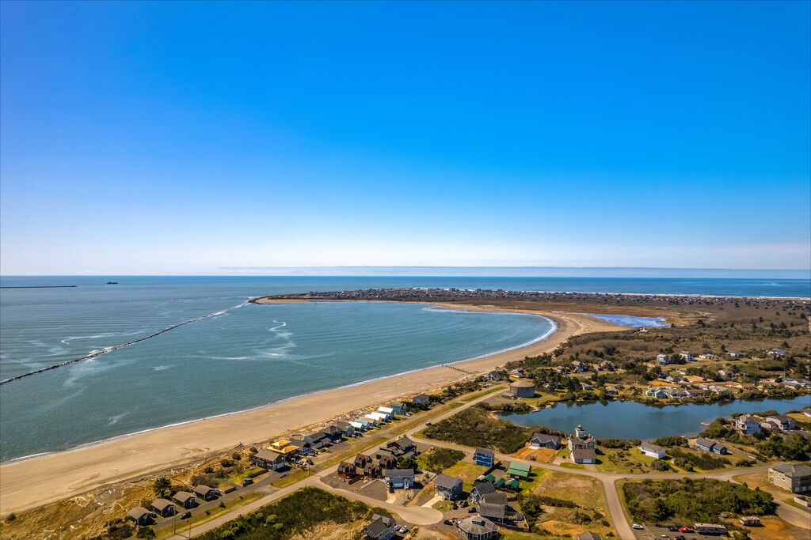

# Buena-onda-rural-coastal-hazard-tool-kit-
<figure>
    
    <figcaption><em>Figure 1: Ocean Shores</em></figcaption>
</figure>

Hello!

Members: Florencia Gonzalez-Martinez and Paulinne Anaya

## Topic Title: Rural Coastal Hazard Mitigation

## Introductory background information: 

Florencia's Capstone Studio Project: Coastal Community Adaptation: Planning and Designing Upland Expansion and Relocation

The current capstone studio project examines strategies for hazard mitigation in rural coastal regions. The scope of work is centered in Washington's Coastal region, especially in Westport and Grayland. As coastal erosion occurs due to intense winter storms, high-energy waves, and other climate related factors. Home owners and communities in the rural coastal areas face the problem of losing their communities and home ownership.

Rural coastal communities are primarily served by county governments, which function as the local governing authority for areas outside incorporated city limits. However, a significant gap often exists between county governments and rural communities due to disparities in resources, limited institutional capacity, and differing local needs. Many rural coastal communities are particularly vulnerable and under-resourced, making it difficult for county governments to adequately serve them. This disconnect can contribute to the decline of rural coastal communities and the deterioration of local economies.

## Short 1-2 sentence summary
Rural coastal hazard mitigation is a critical planning priority. By developing an interactive web mapping tool that can support this effort by enhancing public education and awareness of local hazards and available mitigation strategies. Such a tool can assist both county governments and residents in identifying areas for improvement by visualizing risks related to coastal erosion and flooding.

## Problem statement, question(s) and/or objective(s):
Our objective is to develop an interactive web mapping tool for county governments and residents in identifying areas for improvement by visualizing risks related to coastal erosion and flooding. Tentatively we are considering looking at Washington coastal communities of Westport and Grayland and would like to compile 19 year tidal data and satellite images of the coastline to map shoreline change due to erosion. To get a better understanding of communities that are affected by coastal erosion and flooding a layer showing census data will display demographics impacted.

## Datasets you will use (with links, if available)
- We obtained satellite imagery (Landsat and Sentinel-2) by accessing data from [Google Eeath Engine](https://earthengine.google.com/) through its Python API.

## Tools/packages you’ll use (with links)
The packages: 
- [Coastsat](https://github.com/kvos/CoastSat)

The tools we will be using is:
- matplotlib
- pickle
- numpy
- os
- contextily
- datetime
- ee

## Planned methodology/approach
We divided our work into two parts:
1. Erosion Analysis
   - Retrieval of satellite images for the region of interest from Google Earth Engine
     - Call a function to check availability of satellite images (L8, L9, S2) before loading
     - Use a for loop to avoid downloading ~2,000 images
     - Apply a time range of ±5 days from 07-27 for each year
   - Shoreline extraction at sub-pixel resolution
     - Set cloud threshold (`cloud_thresh`)
     - Select spatial reference system (`output_epsg`) for shoreline coordinates
     - Manually digitize a reference shoreline to identify outliers and false detections
     - Extract batches of shoreline detections as 2D shorelines
     - Classify features: sand, ocean, shoreline, and white water
   - Shoreline data processing
     - Extract shorelines into points per year
   - Shoreline analysis
     - Intersect shorelines with cross-shore transects
     - Compute time series of cross-shore distance along shore-normal transects

## Expected outcomes
The expected outcome is to develop an interactive ipyleaflet map that demonstrates demographic patterns through a choropleth overlay highlighting areas affected by erosion and flooding. The goal is to gain insight into the populations that have been impacted and to better understand the social changes that have occurred among residents living in these areas.

This tool will allow users to interactively explore potential locations that could serve as resilience zones, meaning areas that may provide housing opportunities or support community stability and economic continuity. In addition to identifying hazard-prone regions, the map is designed to be an accessible and user-friendly resource for the public, enabling a clearer understanding of environmental risks and their social implications.

## Short Comings
Working within a new environment such as CoastSat required extensive package installation and a significant effort to understand the volume of data it can retrieve, as well as the accuracy and extent of shoreline detection it provides. A key challenge arose from the format of CoastSat outputs, which are generated as point data rather than continuous lines, making it difficult to represent shorelines as coherent linear features. Additional difficulties were encountered in converting these point datasets into array formats compatible with tools such as hvPlot for interactive visualization.

Furthermore, computational limitations posed constraints, as the process of downloading and processing multiple satellite datasets (e.g., Landsat and Sentinel imagery) was slow and memory-intensive on local hardware. Consequently, a substantial portion of the project timeline was devoted to troubleshooting technical issues, which significantly impacted overall progress within the given deadline.

## Any other relevant information, images/tables, references, etc.
In the College of the Built Environment, hazard mitigation planning research has primarily been conducted using static mapping. Developing a dynamic, interactive map would help address potential planning challenges and generate new insights. By allowing community partners, government agencies, and the public to explore data independently, this approach could enhance analysis and support more informed decision-making.

For example, see [Westport's Comprehensive Plan Update](https://mitigate.be.uw.edu/research-and-practice-2/research-and-practice)

While Grays Harbor County created a comprehensive 2024 Hazard Mitigation Plan, the document is lengthy and difficult for the general public to navigate. Because of its size and technical language, many residents may struggle to fully understand the risks affecting their communities.

An interactive tool would make this information more accessible and engaging. By transforming the plan into a user-friendly platform, such as an interactive map or dashboard, residents could easily explore local hazards, understand potential impacts, and learn about preparedness strategies. This would empower community members to become more informed and proactive about environmental risks in their area.

See [Grays Harbor County's Hazard Mitigation Plan 2024](https://cms5.revize.com/revize/graysharborcounty/Emergency%20Management/Planning/Grays%20Harbor%20County%20HMP_Vol_1_07152024_Final_Adopted.pdf?t=202407181552150&t=202407181552150)
## References
Our initial reference/precedent Case Study:
- [Integrated GIS-hydrologic-hydraulic modeling to assess combined flood drivers in coastal regions: a case study of Bonita Bay, Florida](https://www.frontiersin.org/journals/water/articles/10.3389/frwa.2024.1468354/full)
- [Inland Hydrology and Coastal Ocean Compound Flooding](https://coastaloceanmodels.noaa.gov/coupling/02_inland_coastal_coupling.html)
